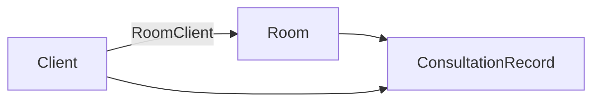
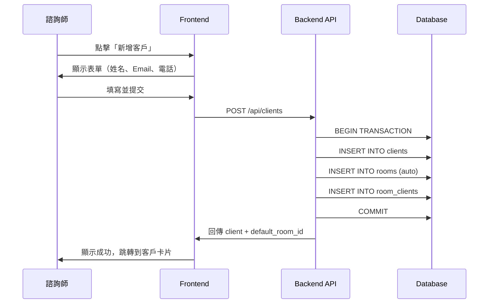
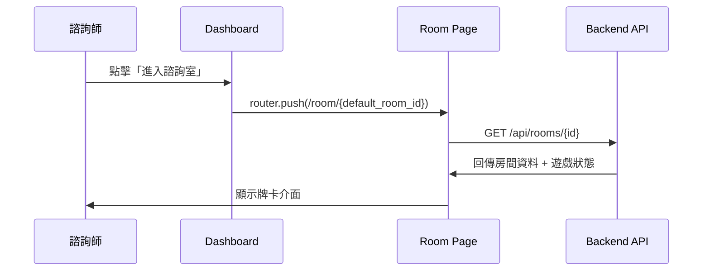
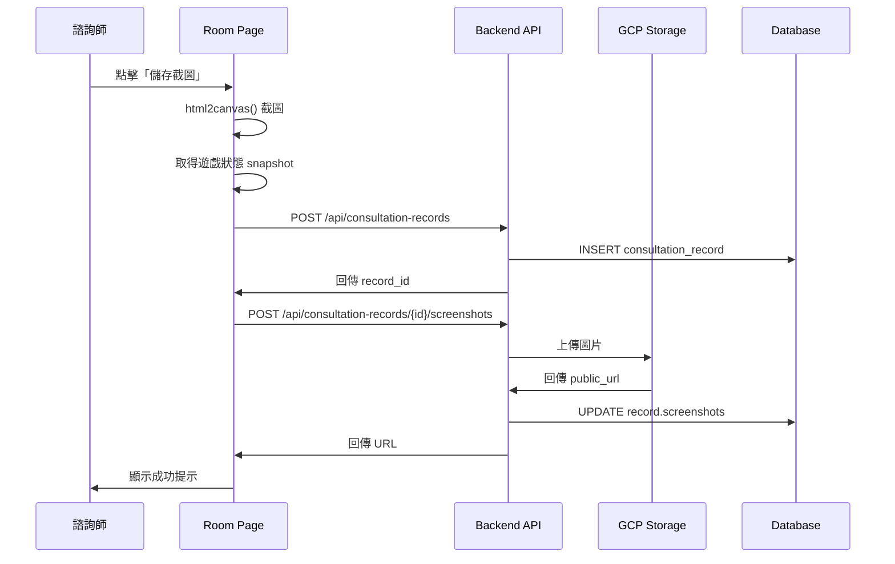

# 客戶諮詢室簡化架構 - 技術規格

## 📋 文件資訊

- **版本**: v1.0
- **日期**: 2025-10-11
- **狀態**: Draft
- **負責人**: Backend + Frontend Team

## 🎯 目標

### 用戶需求

- 前端顯示：**一個客戶 = 一個諮詢室**（簡化 UX）
- 後端架構：保留 **一對多** 彈性（未來擴充）
- 諮詢記錄：以 **截圖 + Snapshot** 方式儲存

### 技術目標

- ✅ 不破壞現有資料庫架構
- ✅ 最小化前端改動
- ✅ 為 CRM 系統奠基
- ✅ 支援未來團體諮詢場景

---

## 🏗️ 現有架構分析

### 資料模型（已存在）



```python
# 多對多關係（已實作）
Client (1) ←→ (N) RoomClient (N) ←→ (1) Room

# 諮詢記錄
ConsultationRecord
├── room_id
├── client_id
├── session_date
├── notes
└── topics
```

### 現有限制

1. ❌ Dashboard 顯示「房間列表」而非「客戶列表」
2. ❌ 沒有「預設房間」概念
3. ❌ ConsultationRecord 缺少截圖欄位
4. ❌ Room 的 `expires_at` 不適合長期諮詢室

---

## 🎨 前端 UX 設計

### 頁面架構調整

#### Before（現況）

```
Dashboard
├── 房間列表
│   ├── 「2024-10-01 諮詢」[進入]
│   ├── 「小明的職涯探索」[進入]
│   └── [新增房間]
```

#### After（目標）

```
Dashboard
├── 客戶列表
│   ├── 小明
│   │   └── [進入諮詢室] → /room/{default_room_id}
│   ├── 小華
│   │   └── [進入諮詢室]
│   └── [新增客戶]
│
└── 客戶詳情（點擊客戶名稱展開）
    ├── 基本資訊
    ├── 諮詢記錄列表（截圖縮圖）
    └── [查看完整歷史]
```

### URL 結構（不變）

```
/dashboard              # 顯示客戶列表（而非房間列表）
/room/[roomId]          # 房間頁面（不變）
/client/[clientId]      # 客戶詳情（新增）
```

---

## 🔧 後端調整

### 1. 資料庫 Migration

#### 1.1 新增欄位到 `consultation_records`

```sql
-- Migration: add_screenshots_and_snapshot_to_consultation_records

ALTER TABLE consultation_records
ADD COLUMN screenshots TEXT[] DEFAULT '{}',
ADD COLUMN snapshot JSONB,
ADD COLUMN ai_summary TEXT;

-- 建立索引
CREATE INDEX idx_consultation_records_room ON consultation_records(room_id);
CREATE INDEX idx_consultation_records_client ON consultation_records(client_id);
```

#### 1.2 調整 `rooms` 表（可選）

```sql
-- Migration: make_rooms_permanent

-- 將 expires_at 改為 nullable（已經是了）
-- 新增 archived_at 用於軟刪除
ALTER TABLE rooms
ADD COLUMN archived_at TIMESTAMP;

-- 建立索引
CREATE INDEX idx_rooms_archived ON rooms(archived_at) WHERE archived_at IS NOT NULL;
```

### 2. Model 更新

#### 2.1 `ConsultationRecord` 擴充

```python
# backend/app/models/client.py

class ConsultationRecord(SQLModel, table=True):
    __tablename__ = "consultation_records"

    id: UUID = Field(default_factory=uuid4, primary_key=True)
    room_id: UUID = Field(foreign_key="rooms.id", index=True)
    client_id: UUID = Field(foreign_key="clients.id", index=True)
    counselor_id: UUID = Field(foreign_key="users.id", index=True)

    session_date: datetime = Field(description="Consultation session date")
    duration_minutes: Optional[int] = None

    # 🆕 新增欄位
    screenshots: List[str] = Field(
        default_factory=list,
        sa_column=Column(JSON),
        description="Screenshot URLs from GCP Storage"
    )
    snapshot: Optional[Dict[str, Any]] = Field(
        default=None,
        sa_column=Column(JSON),
        description="Game state snapshot (cards, positions, etc.)"
    )
    ai_summary: Optional[str] = Field(
        default=None,
        description="AI-generated consultation summary"
    )

    # 現有欄位
    notes: Optional[str] = None
    topics: List[str] = Field(default_factory=list, sa_column=Column(JSON))
    follow_up_required: bool = False
    follow_up_date: Optional[date] = None

    created_at: datetime = Field(default_factory=datetime.utcnow)
    updated_at: datetime = Field(default_factory=datetime.utcnow)
```

#### 2.2 Response Schema 調整

```python
class ClientDetailResponse(ClientResponse):
    """客戶詳情（含預設房間）"""

    default_room_id: Optional[UUID] = Field(
        default=None,
        description="First room ID (ordered by created_at)"
    )
    default_room_name: Optional[str] = None
    recent_records: List[ConsultationRecordResponse] = Field(
        default_factory=list,
        description="Recent 5 consultation records"
    )

class ConsultationRecordResponse(SQLModel):
    """諮詢記錄回應（含截圖）"""

    id: UUID
    room_id: UUID
    client_id: UUID
    session_date: datetime
    duration_minutes: Optional[int]

    # 🆕 截圖與快照
    screenshots: List[str] = Field(default_factory=list)
    snapshot: Optional[Dict[str, Any]] = None
    ai_summary: Optional[str] = None

    notes: Optional[str]
    topics: List[str]
    created_at: datetime
```

### 3. API 端點

#### 3.1 取得客戶列表（含預設房間）

```python
# backend/app/api/routes/clients.py

@router.get("/clients", response_model=List[ClientDetailResponse])
async def get_clients(
    current_user: User = Depends(get_current_user),
    db: Session = Depends(get_db),
    include_archived: bool = False
):
    """
    取得諮詢師的所有客戶

    - 自動包含每個客戶的「預設房間」（第一個建立的 Room）
    - 包含最近5筆諮詢記錄
    """

    # 查詢客戶
    query = db.query(Client).filter(Client.counselor_id == current_user.id)
    if not include_archived:
        query = query.filter(Client.status != ClientStatus.ARCHIVED)

    clients = query.all()

    result = []
    for client in clients:
        # 取得第一個 Room（作為預設房間）
        default_room = (
            db.query(Room)
            .join(RoomClient, Room.id == RoomClient.room_id)
            .filter(
                RoomClient.client_id == client.id,
                Room.is_active == True,
                Room.archived_at.is_(None)
            )
            .order_by(Room.created_at.asc())
            .first()
        )

        # 取得最近5筆諮詢記錄
        recent_records = (
            db.query(ConsultationRecord)
            .filter(ConsultationRecord.client_id == client.id)
            .order_by(ConsultationRecord.session_date.desc())
            .limit(5)
            .all()
        )

        result.append({
            **client.dict(),
            "default_room_id": default_room.id if default_room else None,
            "default_room_name": default_room.name if default_room else None,
            "recent_records": recent_records,
            "total_consultations": len(client.consultation_records),
            "active_rooms_count": len([
                rc for rc in client.room_associations
                if rc.room.is_active and not rc.room.archived_at
            ])
        })

    return result
```

#### 3.2 建立客戶（自動建立房間）

```python
@router.post("/clients", response_model=ClientDetailResponse)
async def create_client(
    client_data: ClientCreate,
    current_user: User = Depends(get_current_user),
    db: Session = Depends(get_db)
):
    """
    建立新客戶，自動建立第一個諮詢室
    """

    async with db.begin():
        # 1. 建立 Client
        client = Client(
            counselor_id=current_user.id,
            **client_data.dict()
        )
        db.add(client)
        await db.flush()

        # 2. 自動建立第一個 Room
        room = Room(
            counselor_id=current_user.id,
            name=f"{client.name or '匿名'} 的諮詢室",
            description="主要諮詢空間",
            is_active=True,
            expires_at=None  # 永久有效
        )
        db.add(room)
        await db.flush()

        # 3. 建立關聯
        room_client = RoomClient(
            room_id=room.id,
            client_id=client.id
        )
        db.add(room_client)
        await db.commit()

    return {
        **client.dict(),
        "default_room_id": room.id,
        "default_room_name": room.name,
        "recent_records": [],
        "total_consultations": 0,
        "active_rooms_count": 1
    }
```

#### 3.3 儲存諮詢記錄（含截圖）

```python
@router.post("/consultation-records", response_model=ConsultationRecordResponse)
async def save_consultation_record(
    record_data: ConsultationRecordCreate,
    current_user: User = Depends(get_current_user),
    db: Session = Depends(get_db)
):
    """
    儲存諮詢記錄（含截圖與牌卡快照）
    """

    # 驗證 room 和 client 存在且屬於當前諮詢師
    room = db.query(Room).filter(
        Room.id == record_data.room_id,
        Room.counselor_id == current_user.id
    ).first()

    if not room:
        raise HTTPException(status_code=404, detail="Room not found")

    client = db.query(Client).filter(
        Client.id == record_data.client_id,
        Client.counselor_id == current_user.id
    ).first()

    if not client:
        raise HTTPException(status_code=404, detail="Client not found")

    # 建立記錄
    record = ConsultationRecord(
        counselor_id=current_user.id,
        **record_data.dict()
    )
    db.add(record)
    await db.commit()
    await db.refresh(record)

    return record


@router.post("/consultation-records/{record_id}/screenshots")
async def upload_screenshot(
    record_id: UUID,
    file: UploadFile,
    current_user: User = Depends(get_current_user),
    db: Session = Depends(get_db)
):
    """
    上傳截圖到 GCP Storage，並更新記錄
    """

    # 1. 驗證記錄存在
    record = db.query(ConsultationRecord).filter(
        ConsultationRecord.id == record_id,
        ConsultationRecord.counselor_id == current_user.id
    ).first()

    if not record:
        raise HTTPException(status_code=404, detail="Record not found")

    # 2. 上傳到 GCP Storage
    from app.services.storage import upload_to_gcs

    file_path = f"screenshots/{current_user.id}/{record_id}/{uuid4()}.png"
    public_url = await upload_to_gcs(
        file.file,
        file_path,
        content_type="image/png"
    )

    # 3. 更新記錄
    record.screenshots = record.screenshots + [public_url]
    record.updated_at = datetime.utcnow()
    await db.commit()

    return {"url": public_url}
```

---

## 🎨 前端調整

### 1. Dashboard 改版

#### 1.1 客戶列表組件

```typescript
// frontend/src/app/dashboard/page.tsx

import { useClients } from '@/hooks/useClients';
import { ClientCard } from '@/components/dashboard/ClientCard';
import { CreateClientButton } from '@/components/dashboard/CreateClientButton';

export default function DashboardPage() {
  const { data: clients, isLoading } = useClients();

  if (isLoading) return <Loading />;

  return (
    <div className="container mx-auto p-6">
      <div className="flex justify-between items-center mb-6">
        <h1 className="text-2xl font-bold">我的客戶</h1>
        <CreateClientButton />
      </div>

      <div className="grid grid-cols-1 md:grid-cols-2 lg:grid-cols-3 gap-4">
        {clients.map(client => (
          <ClientCard key={client.id} client={client} />
        ))}
      </div>
    </div>
  );
}
```

#### 1.2 客戶卡片

```typescript
// frontend/src/components/dashboard/ClientCard.tsx

import { useRouter } from 'next/navigation';
import { ClientDetailResponse } from '@/types/client';

interface Props {
  client: ClientDetailResponse;
}

export function ClientCard({ client }: Props) {
  const router = useRouter();

  const enterRoom = () => {
    if (!client.default_room_id) {
      // 如果沒有房間，自動建立一個
      createRoomAndEnter();
      return;
    }
    router.push(`/room/${client.default_room_id}`);
  };

  return (
    <div className="border rounded-lg p-4 hover:shadow-lg transition">
      <div className="flex justify-between items-start">
        <div>
          <h3 className="text-lg font-semibold">{client.name || '匿名客戶'}</h3>
          <p className="text-sm text-gray-500">{client.email || '無 Email'}</p>
        </div>
        <span className="text-xs bg-green-100 text-green-800 px-2 py-1 rounded">
          {client.status}
        </span>
      </div>

      <div className="mt-4 text-sm text-gray-600">
        <p>諮詢次數：{client.total_consultations}</p>
        <p>最後諮詢：{client.last_consultation_date ?
          formatDate(client.last_consultation_date) : '尚未諮詢'
        }</p>
      </div>

      {/* 最近記錄縮圖 */}
      {client.recent_records.length > 0 && (
        <div className="mt-3 flex gap-2">
          {client.recent_records.slice(0, 3).map(record => (
            <div key={record.id} className="w-16 h-16 rounded overflow-hidden">
              {record.screenshots[0] && (
                
              )}
            </div>
          ))}
        </div>
      )}

      <div className="mt-4 flex gap-2">
        <button
          onClick={enterRoom}
          className="flex-1 bg-blue-600 text-white px-4 py-2 rounded hover:bg-blue-700"
        >
          進入諮詢室
        </button>
        <button
          onClick={() => router.push(`/client/${client.id}`)}
          className="px-4 py-2 border rounded hover:bg-gray-50"
        >
          詳情
        </button>
      </div>
    </div>
  );
}
```

### 2. 房間頁面新增截圖功能

```typescript
// frontend/src/app/room/[roomId]/page.tsx

import { useScreenshot } from '@/hooks/useScreenshot';
import { useSaveRecord } from '@/hooks/useSaveRecord';

export default function RoomPage({ params }: { params: { roomId: string } }) {
  const { takeScreenshot } = useScreenshot();
  const { saveRecord } = useSaveRecord();

  const handleSaveSnapshot = async () => {
    // 1. 截圖
    const screenshotBlob = await takeScreenshot('game-canvas');

    // 2. 取得遊戲狀態
    const gameState = getGameState(); // 從 Zustand store 取得

    // 3. 儲存記錄
    const record = await saveRecord({
      room_id: params.roomId,
      client_id: getCurrentClientId(),
      session_date: new Date(),
      snapshot: gameState,
      notes: getCounselorNotes()
    });

    // 4. 上傳截圖
    if (screenshotBlob) {
      await uploadScreenshot(record.id, screenshotBlob);
    }

    toast.success('諮詢記錄已儲存');
  };

  return (
    <div>
      {/* 遊戲畫布 */}
      <div id="game-canvas">
        <GameBoard />
      </div>

      {/* 控制列 */}
      <div className="fixed bottom-4 right-4 flex gap-2">
        <button onClick={handleSaveSnapshot} className="btn-primary">
          📸 儲存截圖
        </button>
      </div>
    </div>
  );
}
```

### 3. Hooks 實作

```typescript
// frontend/src/hooks/useScreenshot.ts

import html2canvas from 'html2canvas';

export function useScreenshot() {
  const takeScreenshot = async (elementId: string): Promise<Blob | null> => {
    const element = document.getElementById(elementId);
    if (!element) return null;

    const canvas = await html2canvas(element, {
      backgroundColor: '#ffffff',
      scale: 2, // 高解析度
      logging: false
    });

    return new Promise((resolve) => {
      canvas.toBlob((blob) => resolve(blob), 'image/png');
    });
  };

  return { takeScreenshot };
}
```

```typescript
// frontend/src/hooks/useClients.ts

import { useQuery } from '@tanstack/react-query';
import { ClientDetailResponse } from '@/types/client';

export function useClients() {
  return useQuery<ClientDetailResponse[]>({
    queryKey: ['clients'],
    queryFn: async () => {
      const res = await fetch('/api/clients', {
        headers: { Authorization: `Bearer ${getToken()}` }
      });
      return res.json();
    }
  });
}
```

---

## 📊 資料流程

### 建立客戶流程



### 進入諮詢室流程



### 儲存記錄流程



---

## 🧪 測試計畫

### 1. 後端測試

```python
# tests/test_client_routes.py

def test_create_client_auto_creates_room():
    """測試建立客戶時自動建立房間"""
    response = client.post("/api/clients", json={
        "name": "測試客戶",
        "email": "test@example.com"
    })
    assert response.status_code == 200
    data = response.json()
    assert data["default_room_id"] is not None
    assert data["default_room_name"] == "測試客戶 的諮詢室"

def test_get_clients_includes_default_room():
    """測試取得客戶列表包含預設房間"""
    response = client.get("/api/clients")
    assert response.status_code == 200
    clients = response.json()
    for client in clients:
        if client["active_rooms_count"] > 0:
            assert client["default_room_id"] is not None

def test_save_consultation_record_with_screenshot():
    """測試儲存諮詢記錄含截圖"""
    # 1. 建立記錄
    record_response = client.post("/api/consultation-records", json={
        "room_id": str(test_room_id),
        "client_id": str(test_client_id),
        "session_date": "2025-10-11T10:00:00",
        "snapshot": {"cards": [{"id": 1, "position": "dropped"}]}
    })
    record_id = record_response.json()["id"]

    # 2. 上傳截圖
    with open("test_screenshot.png", "rb") as f:
        screenshot_response = client.post(
            f"/api/consultation-records/{record_id}/screenshots",
            files={"file": f}
        )
    assert screenshot_response.status_code == 200
    assert "url" in screenshot_response.json()
```

### 2. 前端測試

```typescript
// __tests__/dashboard.test.tsx

describe('Dashboard - Client List', () => {
  it('should display client cards', async () => {
    render(<DashboardPage />);

    await waitFor(() => {
      expect(screen.getByText('小明')).toBeInTheDocument();
      expect(screen.getByText('小華')).toBeInTheDocument();
    });
  });

  it('should navigate to room when clicking "進入諮詢室"', async () => {
    const mockPush = jest.fn();
    jest.spyOn(require('next/navigation'), 'useRouter').mockReturnValue({
      push: mockPush
    });

    render(<DashboardPage />);

    const enterButton = await screen.findByText('進入諮詢室');
    fireEvent.click(enterButton);

    expect(mockPush).toHaveBeenCalledWith('/room/test-room-id');
  });
});
```

### 3. E2E 測試

```typescript
// e2e/client-consultation.spec.ts

test('完整諮詢流程', async ({ page }) => {
  // 1. 登入
  await page.goto('/login');
  await page.fill('[name="email"]', 'counselor@test.com');
  await page.fill('[name="password"]', 'password');
  await page.click('button[type="submit"]');

  // 2. 建立客戶
  await page.click('text=新增客戶');
  await page.fill('[name="name"]', 'E2E 測試客戶');
  await page.fill('[name="email"]', 'e2e@test.com');
  await page.click('button:has-text("儲存")');

  // 3. 進入諮詢室
  await page.click('text=進入諮詢室');
  await expect(page).toHaveURL(/\/room\/.+/);

  // 4. 操作牌卡
  await page.click('text=職能盤點卡');
  await page.click('text=優劣勢分析');
  // ... 拖曳牌卡操作

  // 5. 儲存截圖
  await page.click('text=儲存截圖');
  await expect(page.locator('text=記錄已儲存')).toBeVisible();

  // 6. 返回 Dashboard 確認記錄
  await page.click('text=返回');
  await expect(page.locator('text=E2E 測試客戶')).toBeVisible();
  // 應該看到縮圖
  await expect(page.locator('img[alt="記錄截圖"]')).toBeVisible();
});
```

---

## 📅 實作計畫

### Phase 1: 後端基礎（Week 7）

- [ ] Migration: 新增 screenshots/snapshot 欄位
- [ ] Model: 更新 ConsultationRecord
- [ ] API: GET /clients（含 default_room_id）
- [ ] API: POST /clients（自動建立 room）
- [ ] 測試: 後端單元測試

### Phase 2: 前端 Dashboard（Week 7-8）

- [ ] Dashboard: 改為客戶列表
- [ ] Component: ClientCard
- [ ] Component: CreateClientButton
- [ ] Hook: useClients
- [ ] 測試: 前端單元測試

### Phase 3: 截圖功能（Week 8）

- [ ] Hook: useScreenshot (html2canvas)
- [ ] API: POST /consultation-records
- [ ] API: POST /screenshots (upload)
- [ ] GCP Storage 整合
- [ ] UI: 截圖按鈕與提示

### Phase 4: 測試與優化（Week 8）

- [ ] E2E 測試
- [ ] 效能測試（大量截圖）
- [ ] UI/UX 調整
- [ ] 文件更新

---

## ⚠️ 風險與注意事項

### 技術風險

| 風險 | 影響 | 緩解措施 |
|------|------|---------|
| html2canvas 品質不佳 | 截圖模糊 | 提高 scale=2，或改用後端渲染 |
| GCS 上傳失敗 | 記錄遺失 | 先儲存記錄，截圖失敗可重傳 |
| 舊房間資料遷移 | 顯示異常 | 提供 migration script 補關聯 |
| 大量截圖存儲成本 | 成本增加 | 設定保留期限，自動壓縮 |

### UX 風險

| 風險 | 影響 | 緩解措施 |
|------|------|---------|
| 用戶不知道如何建立客戶 | 空白頁面 | 空狀態引導 + 快速建立按鈕 |
| 找不到歷史房間 | 混淆 | 客戶詳情頁顯示所有房間 |
| 截圖時機不明確 | 忘記儲存 | 離開房間前提醒 |

---

## 📝 相關文件

- [PRD.md](../PRD.md) - 產品需求文件
- [SYNC_ARCHITECTURE.md](./SYNC_ARCHITECTURE.md) - 即時同步架構
- [第二個月目標](https://docs.google.com/document/d/1vSz-w5ST-hQKcZ85ALZlOF-AcxHzVt6bSWvzitH4_X4/edit) - Google Docs

---

## 🔄 更新記錄

- **v1.0** (2025-10-11): 初版規格，定義架構與實作計畫
