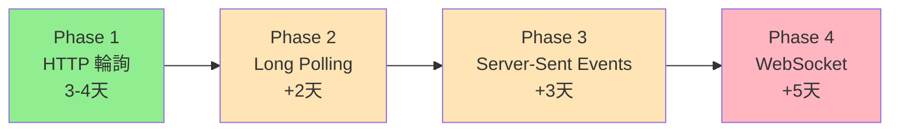

# WebSocket vs 輪詢：技術決策分析

## 🤔 為什麼不直接實作 WebSocket？

### 📊 成本對比分析

## 1. WebSocket 實作成本（預估 8-10 天）

### 後端工作（3-4天）

```python
# 需要新增的後端架構
1. WebSocket 服務器設置
   - FastAPI WebSocket 端點
   - 連線管理器 (ConnectionManager)
   - 心跳檢測機制
   - 斷線重連邏輯

2. 房間管理系統
   - 用戶加入/離開房間
   - 房間狀態廣播
   - 用戶在線狀態追蹤

3. 訊息路由系統
   - 訊息類型定義
   - 事件分發機制
   - 錯誤處理

4. 狀態同步邏輯
   - 狀態差異計算
   - 衝突解決機制
   - 版本控制
```

### 前端工作（2-3天）

```typescript
// 需要新增的前端架構
1. WebSocket 客戶端
   - 連線管理
   - 自動重連
   - 指數退避策略

2. 事件處理系統
   - 訊息解析
   - 狀態更新
   - 錯誤處理

3. 離線處理
   - 離線隊列
   - 重連後同步
   - 衝突解決
```

### 部署與運維（2-3天）

```yaml
# 新增的基礎設施需求
1. WebSocket 支援
   - Cloud Run 不原生支援 WebSocket
   - 需要改用 GKE 或 Compute Engine
   - 或使用 Cloud Run with session affinity

2. 負載均衡設置
   - Sticky sessions
   - WebSocket 協議升級
   - 健康檢查配置

3. 監控告警
   - 連線數監控
   - 斷線率追蹤
   - 延遲監測
```

---

## 2. 智能輪詢實作成本（預估 3-4 天）

### 後端工作（1天）

```python
# 利用現有 API，只需新增
POST /api/rooms/{id}/game-state
GET  /api/rooms/{id}/game-state

# 資料庫只需一張表
CREATE TABLE game_states (
  room_id, state, version, updated_at
)
```

### 前端工作（1-2天）

```typescript
// 簡單的輪詢服務
class PollingService {
  poll() {
    setInterval(() => fetch('/api/rooms/{id}/game-state'), 2000)
  }
}
```

### 部署（0.5天）

- 現有 Cloud Run 直接支援
- 無需額外基礎設施
- 使用現有監控

---

## 📈 技術風險對比

### WebSocket 風險 🔴 高

| 風險項目 | 影響 | 說明 |
|---------|------|------|
| 連線不穩定 | 高 | 移動網路、防火牆、代理問題 |
| 擴展性問題 | 高 | 每個連線佔用伺服器資源 |
| 除錯困難 | 中 | 難以重現和追蹤問題 |
| 瀏覽器相容 | 低 | 舊瀏覽器、企業防火牆 |
| 部署複雜 | 高 | Cloud Run 限制多 |

### 輪詢風險 🟢 低

| 風險項目 | 影響 | 說明 |
|---------|------|------|
| 延遲較高 | 低 | 2-4秒延遲可接受 |
| 流量消耗 | 低 | 只傳差異資料 |
| 伺服器壓力 | 低 | 無狀態，易擴展 |

---

## 💰 成本分析

### WebSocket 月成本

```text
GKE Cluster: $70-100/月
Load Balancer: $20/月
額外流量: $10-30/月
總計: $100-150/月
```

### 輪詢月成本

```text
Cloud Run: $10-20/月
額外 API 請求: $5-10/月
總計: $15-30/月
```

---

## 🎯 關鍵決策因素

### 1. 時間壓力 ⏰

- **需求**：一週內交付
- **WebSocket**：8-10天（超時）
- **輪詢**：3-4天（準時）

### 2. 用戶體驗 👥

- **需求**：諮詢師與來訪者協作
- **實際場景**：
  - 諮詢師主導，來訪者觀看
  - 不是即時對戰遊戲
  - 2-4秒延遲可接受

### 3. 技術債務 🏗️

- **WebSocket**：引入大量新架構
- **輪詢**：幾乎零技術債務

### 4. 團隊能力 👨‍💻

- **現況**：無 WebSocket 經驗
- **學習成本**：需額外 2-3 天

---

## 📊 真實案例參考

### 成功使用輪詢的產品

1. **Trello** - 看板同步（5秒輪詢）
2. **GitHub** - PR 狀態更新（3秒輪詢）
3. **Gmail** - 郵件推送（可配置）
4. **Slack** - 訊息同步（混合方案）

### 為什麼他們選擇輪詢？

- 可靠性 > 即時性
- 簡單 > 複雜
- 可維護性 > 性能

---

## 🚀 漸進式升級路徑



### 每階段收益

1. **Phase 1（本週）**：基本同步可用 ✅
2. **Phase 2（可選）**：減少請求數
3. **Phase 3（可選）**：單向即時推送
4. **Phase 4（未來）**：雙向即時通訊

---

## 💡 具體例子：為什麼輪詢夠用

### 諮詢場景分析

```text
諮詢師：「請把你喜歡的職業拖到左邊」
來訪者：[拖曳卡片]
諮詢師：[2-4秒後看到] 「很好，我看到你選了...」

這個延遲在對話節奏中幾乎無感！
```

### 對比即時遊戲

```text
玩家A：[開槍]
玩家B：[需要 <100ms 反應躲避]

這種場景才真正需要 WebSocket！
```

---

## 📝 結論與建議

### 為什麼選擇輪詢？

1. **務實考量** 📅
   - 一週交付期限
   - 輪詢可 3 天完成
   - WebSocket 需 10 天

2. **場景適合** 🎯
   - 諮詢不是電競
   - 2-4 秒延遲可接受
   - 用戶預期管理得當

3. **風險控制** 🛡️
   - 技術成熟可靠
   - 除錯維護簡單
   - 隨時可升級

4. **成本效益** 💰
   - 開發成本低 70%
   - 運維成本低 80%
   - 技術債務幾乎為零

### 未來升級時機

當以下條件**同時**滿足時，再考慮 WebSocket：

- [ ] 日活躍用戶 > 1000
- [ ] 同時在線房間 > 100
- [ ] 用戶明確要求 <1秒 延遲
- [ ] 有專職後端維護
- [ ] 月預算 > $500

---

## 🎬 行動建議

### 立即執行（本週）

```bash
✅ 實作 HTTP 輪詢
✅ 2-4 秒更新頻率
✅ 樂觀更新UI
✅ 3-4 天完成
```

### 觀察指標（上線後）

```bash
📊 用戶滿意度
📊 同步延遲體感
📊 伺服器負載
📊 流量成本
```

### 升級決策（3個月後）

```bash
🔄 如果用戶抱怨延遲 → 考慮 Long Polling
🔄 如果需要推送通知 → 考慮 SSE
🔄 如果需要雙向即時 → 考慮 WebSocket
```

---

## 分析日期

2025-09-29

## 一句話總結

> 「不是不能做 WebSocket，而是**現在不需要**。」

輪詢就像騎腳踏車，雖然不是最快，但是：

- 簡單可靠 ✅
- 成本低廉 ✅
- 隨時可換汽車 ✅

而 WebSocket 就像開跑車，很快但是：

- 需要專業駕駛 ❌
- 維護成本高 ❌
- 可能會拋錨 ❌

**對於職涯諮詢這種場景，腳踏車就夠了！**
