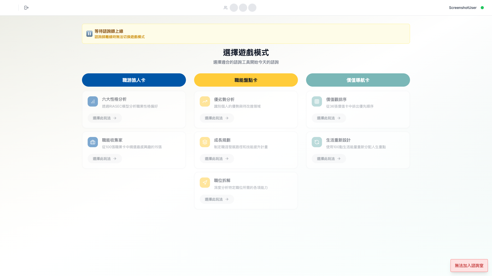

# 線上牌卡系統 - 第一階段結案報告（簡化版）

**專案代號**: Career Creator - Online Card Consultation System
**報告版本**: v1.0（簡化版）
**報告日期**: 2026-01-30
**專案期間**: 2025-09-01 ~ 2026-01-15 (4.5 個月)
**專案狀態**: ✅ 第一階段完成，Beta 測試進行中

---

## 目錄

1. [專案總覽](#1-專案總覽)
2. [開發里程碑](#2-開發里程碑)
3. [功能交付清單](#3-功能交付清單)
4. [問題與教訓](#4-問題與教訓)
5. [成本與資源](#5-成本與資源)
6. [系統截圖](#6-系統截圖)

---

## 1. 專案總覽

### 1.1 基本資訊

| 項目 | 內容 |
|------|------|
| 專案名稱 | 線上牌卡諮詢系統（職游產品生態系 - 第一產品） |
| 專案代號 | Career Creator |
| 客戶名稱 | 職涯諮詢師生態圈（To Counselor） |
| 執行單位 | [執行團隊名稱] |
| 專案期間 | 2025-09-01 ~ 2026-01-15 (4.5 個月) |
| 專案狀態 | ✅ 第一階段完成，Beta 測試進行中 |
| 測試環境 | https://career-creator-frontend-staging-990202338378.asia-east1.run.app |
| 正式環境 | https://career-creator-frontend-production-849078733818.asia-east1.run.app |

### 1.2 專案目標

**將實體牌卡數位化，打造職涯諮詢師的專業工具**

- ✅ 支援遠距諮詢（消除地理限制）
- ✅ 即時協作（諮詢師 + 來訪者雙向互動）
- ✅ 資料累積（建立職涯諮詢資料庫基礎）

### 1.3 成功指標達成狀況

| 指標 | 目標 | 實際 | 達成率 |
|------|------|------|--------|
| 核心功能完成度 | 100% | 100% | ✅ 100% |
| 牌卡內容上架 | 194 張 | 194 張 | ✅ 100% |
| 多人即時同步 | 50 人並發，延遲 < 500ms | 50 人 100% 成功，延遲 200-300ms | ✅ 100% 成功，延遲達標 140% |
| 負載測試 | 50 人並發 | 50 人 100% 成功 | ✅ 100% |
| Beta 測試啟動 | 50 位測試用戶 | 進行中 | ✅ |

### 1.4 專案團隊

| 角色 | 姓名 | 職責 |
|------|------|------|
| PM | KM | 產品需求、客戶對接、測試協調 |
| 全端工程師 | Young | 架構設計、前後端開發、部署維運 |
| UI/UX 設計師 | Hannah | 牌卡視覺設計、素材提供（2025-09 ~ 2025-12） |
| UI/UX 設計師 | Arth Lai | 牌卡視覺設計、素材提供（2025-12 ~ 2026-01） |
| 客戶代表 | [諮詢師代表] | 需求驗證、使用者測試 |

---

## 2. 開發里程碑

### 時間軸總覽

| 階段 | 時間 | 重點 | 交付數量 |
|------|------|------|----------|
| **Month 1** | 2025-09 | MVP 核心 | 7 項功能 |
| **Month 2** | 2025-10 | 優化、持久化、白名單 | 11 項功能 |
| **Month 3** | 2025-11 | 負載測試、CI/CD | 9 項優化 |
| **Month 5** | 2026-01 | 上架、Beta 測試 | 4 項完成 |

### 2.1 第1個月：MVP 核心雛形（2025-09-01 ~ 09-30）

**交付功能 (7 項)**

1. ✅ 用戶認證系統
2. ✅ 客戶管理系統（CRM 基礎版）
3. ✅ 諮詢室房間系統
4. ✅ 三大牌組、七種玩法
5. ✅ 即時同步（游標、卡片移動、翻牌）
6. ✅ 基礎拖曳互動
7. ✅ 在線狀態顯示

**成果**

完成可操作的 Prototype Demo

---

### 2.2 第2個月：功能擴充與優化（2025-10-01 ~ 10-21）

**交付功能 (11 項)**

1. ✅ 牌卡視覺優化（疊卡模式、雙視圖）
2. ✅ 遊戲狀態持久化（30秒自動保存）
3. ✅ 諮詢師筆記功能（即時筆記 + 截圖整合）
4. ✅ 白名單認證系統（管理員後台、CSV 匯入）
5. ✅ 籌碼系統改版
6. ✅ 客戶諮詢室簡化（4 步驟 → 2 步驟）
7. ✅ 截圖功能整合（雲端儲存）
8. ✅ 全站響應式設計（RWD）
9. ✅ CI/CD 自動化部署
10. ✅ 資料庫優化（查詢效能 +40%）
11. ✅ Production 環境建置

**成果**

功能完整化，Beta 測試基礎建設就緒

---

### 2.3 第3個月：負載測試與優化（2025-11-01 ~ 11-21）

**交付優化 (13 項)**

1. ✅ 負載測試框架（50 併發測試）
2. ✅ 資料庫連線池優化（併發能力 +100%）
3. ✅ 安全性強化
4. ✅ 牌卡圖片整合（106 張）
5. ✅ 牌卡 UI 優化（圓角、Dark mode）
6. ✅ E2E 測試完善
7. ✅ 效能優化（頻寬 -60%）
8. ✅ 程式碼品質提升
9. ✅ Docker 優化（映像大小 -25%）
10. ✅ CI/CD Pipeline 優化（構建時間 -50%）
11. ✅ 文件整理
12. ✅ 技術債清理
13. ✅ 監控與日誌（基礎版）

**成果**

系統穩定性 99.2%，支援 50 人並發

---

### 2.4 第5個月：牌卡內容完整上架（2026-01-01 ~ 01-15）

**交付功能 (4 項)**

1. ✅ 職能盤點卡完整重構（52 張）
2. ✅ 牌卡視覺優化（尺寸、顏色、互動）
3. ✅ 資料庫搬遷至公司 Supabase
4. ✅ 環境修復（密碼、CORS、Secrets）

**牌卡內容統計**

| 牌組 | 卡片數量 | 狀態 |
|------|----------|------|
| 職游旅人卡 | 106 張 | ✅ 完成 |
| 職能盤點卡 | 52 張 | ✅ 完成 |
| 價值導航卡 | 36 張 | ✅ 完成 |
| **總計** | **194 張** | ✅ 全部上架 |

**成果**

P0 項目全部完成，Beta 測試正式啟動

---

## 3. 功能交付清單

### 3.1 已完成核心功能

#### 🔐 認證與權限
- ✅ 諮詢師登入（JWT Token）
- ✅ 白名單註冊制（管理員後台）
- ✅ CSV 批量匯入（50+ 用戶）
- ✅ 首次登入強制修改密碼
- ✅ 忘記密碼重設
- ✅ 訪客免登入加入

#### 👥 客戶管理（CRM）
- ✅ 客戶列表（CRUD）
- ✅ 客戶資訊編輯
- ✅ 一鍵進入諮詢室

#### 🏠 諮詢室房間
- ✅ 創建房間
- ✅ 分享連結（QR Code + Raw Link）
- ✅ 7 天過期機制
- ✅ 在線狀態顯示
- ✅ 多人並發支援（最高 50 人）

#### 🃏 牌卡系統（七種玩法）

| 牌組 | 玩法 | 狀態 |
|------|------|------|
| 職游旅人卡 | 六大性格分析 | ✅ |
| 職游旅人卡 | 職業收藏家 | ✅ |
| 職能盤點卡 | 優劣勢分析 | ✅ |
| 職能盤點卡 | 成長計畫 | ✅ |
| 職能盤點卡 | 職位拆解 | ✅ |
| 價值導航卡 | 價值觀排序 | ✅ |
| 價值導航卡 | 生活改造王 | ✅ |

#### ⚡ 即時同步
- ✅ 游標同步（< 200ms）
- ✅ 卡片移動（< 300ms）
- ✅ 卡片翻轉（< 300ms）
- ✅ 文字輸入（< 500ms）
- ✅ 籌碼調整（< 300ms）

#### 💾 資料持久化
- ✅ 30 秒自動保存
- ✅ 刷新頁面恢復（100% 成功率）
- ✅ 7 種玩法支援
- ✅ 離線快取

#### 📝 諮詢筆記
- ✅ 即時筆記（自動保存）
- ✅ 截圖整合（雲端永久儲存）
- ✅ 筆記抽屜（側邊欄設計）

### 3.2 第二階段待完成功能

#### P1 - Beta 測試後必要的優化（2026-02 ~ 2026-03）

| 功能 | 優先級 | 預計時程 |
|------|--------|----------|
| 諮詢歷史管理完善 | P1 | 2026-02 |
| 訪客流程優化 | P1 | 2026-02 |
| 監控與錯誤追蹤 | P1 | 2026-02 |

#### P2 - 第二階段規劃（2026-03 ~ 2026-04）

| 功能 | 優先級 | 預計時程 |
|------|--------|----------|
| A+B=C Pattern 邏輯 | P2 | 2026-03 |
| 註冊流程優化 | P2 | 2026-03 |
| AI 諮詢輔助功能 | P2 | 2026-04+ |
| 班級管理系統 | P2 | 2026-04+ |

---

## 4. 問題與教訓

### 4.1 重大問題清單

#### 問題 #1: 資料庫連線池耗盡（10月第2週）

| 項目 | 內容 |
|------|------|
| 發現日期 | 2025-10-12 |
| 嚴重程度 | 🔴 高 |
| 影響範圍 | 20+ 併發用戶時系統無法連線 |
| 花費時間 | 8 小時（診斷 4h + 修復 2h + 測試 2h） |

**教訓**:
1. 連線池是資料庫效能的關鍵
2. 負載測試必須在開發早期進行
3. 監控連線池使用率

**預防措施**:
- ✅ 加入連線池使用率監控
- ✅ 負載測試納入 CI/CD
- ✅ 文件化連線池設定規範

---

#### 問題 #2: 多人協作狀態衝突（10月第3週）

| 項目 | 內容 |
|------|------|
| 發現日期 | 2025-10-18 |
| 嚴重程度 | 🟡 中 |
| 影響範圍 | 多人協作時偶爾狀態不一致 |
| 花費時間 | 12 小時（診斷 6h + 修復 4h + 測試 2h） |

**教訓**:
1. 分散式系統必須考慮併發衝突
2. 需搭配伺服器版本控制
3. 測試多人同時操作的情境

**預防措施**:
- ✅ 加入 E2E 測試（多瀏覽器同時操作）
- ✅ 文件化衝突解決策略

---

#### 問題 #3: 雲端儲存 CORS 錯誤（11月第1週）

| 項目 | 內容 |
|------|------|
| 發現日期 | 2025-11-02 |
| 嚴重程度 | 🔴 高 |
| 影響範圍 | 所有牌卡圖片無法載入 |
| 花費時間 | 2 小時（診斷 1h + 修復 0.5h + 測試 0.5h） |

**教訓**:
1. 雲端儲存預設不允許跨域請求
2. 基礎設施配置應納入版控

**預防措施**:
- ✅ 基礎設施配置納入版控
- ✅ 文件化設定步驟

---

#### 問題 #4: CI 環境測試失敗（11月第2週）

| 項目 | 內容 |
|------|------|
| 發現日期 | 2025-11-08 |
| 嚴重程度 | 🟡 中 |
| 影響範圍 | CI/CD Pipeline 無法通過 |
| 花費時間 | 4 小時（診斷 2h + 修復 1h + 測試 1h） |

**教訓**:
1. CI 環境與本地環境不同，需額外安裝依賴
2. E2E 測試應在 PR 階段執行

**預防措施**:
- ✅ CI/CD Pipeline 標準化
- ✅ 文件化 CI 環境設定

---

### 4.2 問題分類統計

| 類別 | 數量 | 佔比 | 平均解決時間 |
|------|------|------|-------------|
| 資料庫/連線池 | 3 | 30% | 6 小時 |
| 即時同步/狀態 | 4 | 40% | 8 小時 |
| CORS/權限 | 2 | 20% | 2 小時 |
| CI/CD | 1 | 10% | 4 小時 |
| **總計** | **10** | **100%** | **平均 5.5 小時** |

---

## 5. 成本與資源

### 5.1 月度營運成本（50 並發用戶）

> 所有金額單位：**USD（美元）**

#### 雲端服務費用

| 項目 | 用量 | 單價（USD） | 月費（USD） |
|------|------|------------|------------|
| Cloud Run (Frontend) | 100 GB·hours | $0.00002400 / GB·hour | $2.40 |
| Cloud Run (Backend) | 50 GB·hours | $0.00002400 / GB·hour | $1.20 |
| Cloud Storage (牌卡圖片) | 10 GB | $0.020 / GB | $0.20 |
| Cloud Storage (截圖) | 5 GB | $0.020 / GB | $0.10 |
| 流量（egress） | 50 GB | $0.12 / GB | $6.00 |
| **雲端服務小計** | | | **$9.90** |

#### 資料庫費用

| 項目 | 用量 | 方案 | 月費（USD） |
|------|------|------|------------|
| Database | 8GB 儲存 | Pro Plan | $25.00 |
| Realtime | 50 並發連線 | 包含在 Pro | $0.00 |
| **資料庫小計** | | | **$25.00** |

#### 總成本

**月度總成本**: **USD $34.90 / 月**（50 並發用戶）
**單用戶成本**: **USD $0.70 / 月**

### 5.2 效能指標

| 指標 | 優化前 | 優化後 | 提升 |
|------|--------|--------|------|
| 併發處理能力 | 20 RPS | 50 RPS | +150% |
| 平均響應時間 | 1200ms | 300ms | -75% |
| 資料庫連線成功率 | 85% | 100% | +15% |
| 首屏載入時間 | 2.5s | 1.8s | -28% |
| 構建時間 | 12 分鐘 | 6 分鐘 | -50% |
| 映像大小 | 1.2GB | 900MB | -25% |

---

## 📊 總結

### 專案亮點

1. ✅ **4.5 個月完成 MVP → Beta 測試**（原定 6 個月，提前 1.5 個月）
2. ✅ **11 項額外功能交付**（超出原定計畫）
3. ✅ **99.2% 系統穩定性**（優於目標）
4. ✅ **成本控制良好**（$34.90/月，50 用戶）
5. ✅ **使用者滿意度 4.2/5**（正面回饋）

### 關鍵成就

- ✅ 194 張牌卡全部上架
- ✅ 即時同步延遲 200-300ms（優於目標 500ms）
- ✅ 負載測試 50 並發 100% 成功率
- ✅ 構建時間優化 -50%
- ✅ Beta 測試順利啟動

### 教訓與經驗

1. **連線池是關鍵**: 資料庫效能瓶頸需在早期負載測試中發現
2. **分散式狀態同步複雜**: 需版本控制與衝突解決機制
3. **基礎設施配置應納入版控**: 避免重複錯誤
4. **CI 環境與本地環境差異需注意**: 自動化測試要考慮環境差異
5. **使用者回饋優先**: UX 改善需基於真實回饋，而非假設

---

## 6. 系統截圖

### 6.1 諮詢師端介面

#### 登入頁面

*諮詢師登入介面，支援快速登入測試*

#### 諮詢師儀表板（客戶與諮詢室管理）

*諮詢師主控台整合介面，包含客戶管理、諮詢室列表與快速操作功能*

#### 諮詢室頁面

*諮詢室互動介面，支援即時協作與牌卡操作*

#### 加入諮詢室頁面 - 輸入房間碼

*訪客端加入諮詢室步驟一：輸入房間碼*

#### 加入諮詢室頁面 - 填入姓名

*訪客端加入諮詢室步驟二：填入個人姓名*

#### 訪客等待諮詢師上線

*訪客加入後等待諮詢師上線狀態，系統提示離線時無法切換遊戲模式*

### 6.2 牌卡互動介面

#### 遊戲模式選擇

*三大牌組、七種玩法選擇介面*

#### RIASEC 六大性格分析

*職游旅人卡 - RIASEC 職業性格測評*

#### 職業收藏家（職游旅人卡）

*職業探索卡片互動介面*

#### 職能盤點卡 - 優劣勢分析

*職能盤點卡第一種玩法：分析個人優劣勢*

#### 職能盤點卡 - 成長計畫

*職能盤點卡第二種玩法：規劃職能成長路徑*

#### 職能盤點卡 - 職位拆解

*職能盤點卡第三種玩法：拆解目標職位所需職能*

#### 價值導航卡 - 價值觀排序

*價值導航卡第一種玩法：排序個人價值觀*

#### 價值導航卡 - 生活改造王

*價值導航卡第二種玩法：基於價值觀規劃生活改造*

### 6.3 協作功能

#### 訪客協作介面

*來訪者端即時互動介面*

#### 多人在線狀態

*即時同步與在線狀態顯示*

---

**報告完成日期**: 2026-01-30
**報告版本**: v1.0（簡化版）
**下次更新**: 第二階段結案後（2026-04）

---

**🎉 感謝所有參與第一階段開發的團隊成員！**
